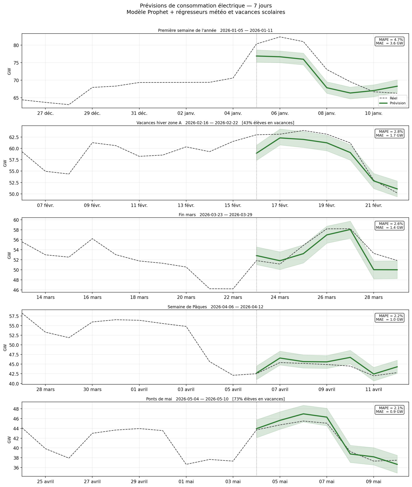
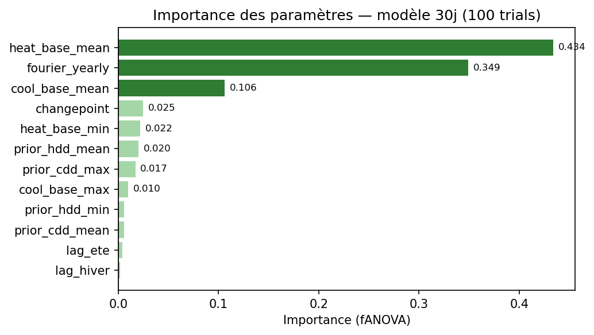

# Prévision consommation électrique France, modèle Prophet

Modèle de prévision de la consommation électrique nationale française à horizons **7 jours** et **30 jours**, construit uniquement avec des données publiques gratuites.

> Projet initialisé dans le cadre d'une formation Data Engineer (Campus Numérique in the Alps) : prédiction de séries temporelles, déploiement de modèles de Machine Learning en production.



---

## Résultats

| Modèle | MAPE test set (8 sem.) | MAPE prod. (2026) |
|--------|----------------------|------------------|
| **Prophet 7j** | **3.09%**[1] | **2.93%**[2] |
| **Prophet 30j** | **2.78%**[1] | **2.64%**[2] |
| Naïf saisonnier | - | 8.9%[3] |
| TimesFM zero-shot (200M) | - | 8.3%[3] |

[1] MAPE test set : moyenne semaine par semaine sur les 8 semaines précédant chaque réentraînement, avec les températures **telles que prévues au moment du run** (conditions de production, cf. § *Validation et promotion*). Hyperparamètres fixés → valeur non biaisée par leur sélection.

[2] MAPE de production : rolling hebdomadaire sur données 2026 jamais vues, avec réentraînement automatique bi-hebdomadaire.

[3] MAPE sur une seule fenêtre de test de 30 jours, protocole moins rigoureux que pour Prophet, à considérer comme indicatif. L'écart important avec Prophet (même peu optimisé, ~4% dès l'ajout de la température brute) a motivé la poursuite avec Prophet plutôt que TimesFM.

---

## Méthodologie

### Données
- **Consommation** : [RTE eco2mix](https://www.services-rte.com/fr/telechargez-les-donnees-publiees-par-rte.html) pour l'historique ("Courbe de consommation", foramt XLS, 15 minutes, agrégées en journalier), complété automatiquement par l'[API RTE Open Data](https://data.rte-france.com) pour les données récentes. Un fichier `rte_clean.csv` sert de data lake local.
- **Météo** : [Open-Meteo](https://open-meteo.com) : Archive API pour l'historique, Forecast API pour J+1 à J+16, moyenne climatologique (3 ans glissants) pour J+17 à J+30.

### Représentation spatiale de la température
4 points ruraux pondérés (hors îlots de chaleur urbains qui biaisent le modèle) :

| Point | Poids | Rôle |
|-------|-------|------|
| Alençon (NW) | 35% | Climat océanique, fort chauffage élec. |
| Bar-le-Duc (NE) | 30% | Climat continental, hivers froids |
| Périgueux (SW) | 20% | Climat tempéré |
| Montélimar (SE) | 15% | Pré-méditerranéen |

La pondération a été optimisée par cross-validation, aucune combinaison testée n'a fait mieux.

### Optimisation
- Hyperparamètres optimisés par **Optuna TPE** (optimisation bayésienne, 100 trials)
- Cross-validation Prophet : `initial='730 days'`, `period='30 days'`



Sur les 100 trials, `heat_base_mean` et `fourier_yearly` sont les paramètres qui font le plus varier la MAPE. Les valeurs optimales sont dans `src/features.py`.

### Validation et promotion
À chaque réentraînement, un modèle d'évaluation est entraîné sur `[2023-01-01 → J−8 semaines]` et évalué semaine par semaine sur les 8 semaines suivantes (le *test set*). Pour rester fidèle à la production, cette évaluation utilise les températures **telles que prévues au moment du run** (journal `temp_forecast_log.csv`) là où le journal les couvre (~30 jours), et les températures réelles au-delà. La MAPE test set est donc une estimation **conservatrice** de la performance réelle.

Le modèle réellement déployé n'est pas ce modèle d'évaluation : si l'évaluation passe, un nouveau modèle est réentraîné sur **100 % des données** (8 dernières semaines incluses) puis promu en Production via le MLflow Model Registry. En cas d'échec, le modèle Production en place est conservé et rien n'est enregistré.

Deux critères conditionnent la promotion :
- **Seuil absolu** : MAPE test set ≤ 5 % (filet de sécurité, toujours actif).
- **Seuil adaptatif** : MAPE test set ≤ mean(ref) + 1,5 × std(ref), où `ref` sont les MAPE de validation production récentes (`validation_log.csv`). Le seuil se resserre automatiquement si le modèle est stable, et se desserre si la production est naturellement bruitée. Actif dès que l'historique de référence compte au moins 5 points ; en dessous, seul le seuil absolu s'applique.

---

## Usage

```bash
# Run bi-hebdomadaire complet (validation + prévisions + retrain)
python run_weekly.py

# Réentraînement manuel
python retrain.py

# Réentraînement sans promotion en Production (mode simulation)
python retrain.py --dry-run

# Dashboard Streamlit
streamlit run app.py
```

### Automatisation (cron lundi + jeudi à 10h)
```bash
bash cron_setup.sh
```


---

## Pistes abandonnées

| Piste | Résultat | Raison |
|-------|---------|--------|
| 8 grandes villes pondérées | +2 pts MAPE | Biais îlots de chaleur urbains |
| Fenêtre 2007-2025 | 5.93% | Concept drift (COVID, crise énergie 2022) |
| Poids asymétriques hiver/été | 2.47% | Pas mieux que symétrique |
| Vacances scolaires (30j) | +0.002 pts | Signal noyé sur 30 jours |
| Saisonnalité conditionnelle | 2.19% | Complexité sans gain |
| Ancrage de prévision | −0.06% | 3/12 prévisions améliorées seulement |
| TimesFM zero-shot | 8.3% | Battu par feature engineering |


